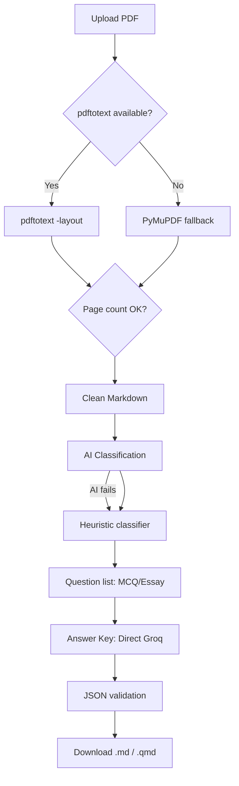

# PDF → Markdown → AI Pipeline — Best Practices

## Overview

This document describes the architecture and best practices for converting PDF exam papers to clean Markdown/Quarto format, then using AI (Groq) to analyze, classify, and generate answer keys. This pipeline is used by ScanGrade for automated exam processing.

```
PDF Upload
  │
  ▼
┌─────────────────────────────────────────────────┐
│         1. PDF → Markdown (pdftotext)            │
│  - pdftotext -layout (poppler-utils) — priority  │
│  - PyMuPDF fallback (fitz)                       │
│  - 500k chars max, 100+ pages supported          │
└─────────────────────────────────────────────────┘
  │
  ▼
┌─────────────────────────────────────────────────┐
│         2. AI Classification                     │
│  - Groq (llama-3.3-70b-versatile)               │
│  - Classify: MCQ vs Essay                        │
│  - Heuristic fallback (regex + CIE patterns)     │
│  - 40/40 accuracy for CIE Paper 1                │
└─────────────────────────────────────────────────┘
  │
  ▼
┌─────────────────────────────────────────────────┐
│         3. Answer Key Generation                 │
│  - Direct Groq API call (no router)              │
│  - MCQ → A/B/C/D only                           │
│  - Essay → model answer + concept explanation    │
│  - Diagram detection: [HAS DIAGRAM]              │
│  - 1 single prompt, no batch splitting           │
└─────────────────────────────────────────────────┘
  │
  ▼
┌─────────────────────────────────────────────────┐
│         4. Download Formats                      │
│  - Hasil Scan: convert_nama.md / .qmd            │
│  - Answer Key:  answerkeys_nama.md / .qmd        │
│  - .md = clean markdown                          │
│  - .qmd = Quarto with YAML header                │
└─────────────────────────────────────────────────┘
```

---

## 1. PDF → Markdown Conversion

### Primary Method: pdftotext (poppler-utils)

```python
import subprocess
import tempfile

def pdf_to_markdown(file_bytes: bytes) -> dict:
    with tempfile.NamedTemporaryFile(suffix=".pdf", delete=False) as tmp:
        tmp.write(file_bytes)
        pdf_path = tmp.name

    try:
        result = subprocess.run(
            ["pdftotext", "-layout", pdf_path, "-"],
            capture_output=True, text=True, timeout=30
        )
        if result.returncode == 0:
            full_text = result.stdout
        else:
            raise RuntimeError(f"pdftotext error: {result.stderr}")
    except FileNotFoundError:
        return _fallback_fitz(file_bytes)
    finally:
        os.unlink(pdf_path)

    # Split by form feed character
    pages = full_text.split("\f")
    return {"markdown": format_markdown(pages), "raw_text": full_text, "page_count": len(pages)}
```

**Key settings:**
- `-layout` flag preserves column structure and whitespace
- 30 second timeout (increase for large PDFs)
- Always fallback to PyMuPDF if pdftotext unavailable

### Fallback Method: PyMuPDF (fitz)

```python
def _fallback_fitz(file_bytes: bytes) -> dict:
    import fitz
    pdf = fitz.open(stream=file_bytes, filetype="pdf")
    pages_md = []
    for i in range(len(pdf)):
        text = pdf[i].get_text()
        pages_md.append(text)
    pdf.close()
    return {"markdown": "\n\n---\n\n".join(pages_md), "page_count": len(pdf)}
```

### Page Count Validation

Always verify page count between pdftotext and PyMuPDF. If mismatch, fallback to PyMuPDF:

```python
# Get actual page count from PyMuPDF
pdf_check = fitz.open(stream=file_bytes, filetype="pdf")
expected_pages = len(pdf_check)
pdf_check.close()

# After pdftotext extraction
if expected_pages and len(pages) < expected_pages:
    return _fallback_fitz(file_bytes)  # fallback
```

---

## 2. Markdown Formatting Rules

### Line Processing

Each line from pdftotext is processed with these rules (in priority order):

| Rule | Condition | Output Format |
|------|-----------|---------------|
| **Equation** | Contains math symbols (`=×÷±√∑∫∞πθΔλμσΩωαβγ`) | `$$ equation $$` |
| **MCQ option** | Starts with `A.` `B.` `C.` `D.` | `  A. option` (indented) |
| **Numbered list** | Starts with `1.` `2.` etc. | As-is |
| **Bullet** | Starts with `-` `•` `*` `–` | `- text` |
| **Page number** | Line is just digits (≤5) | **Skipped** |
| **Paragraph** | Everything else | As-is, 80-char wrapped |

### Page Separation

Pages are separated by `---` in the final markdown (no `\newpage`, no `## Page X` headers).

### Character Limit

```python
# API response limit
"markdown": parsed["markdown"][:500000]  # 500k chars = ~100 pages

# AI prompt limit (Groq context)
md_for_ai = markdown[:30000]  # 30k chars for classification
```

---

## 3. AI Classification (MCQ vs Essay)

### Groq API Call

```python
import requests

def classify_with_ai(markdown: str, api_key: str) -> list:
    prompt = f"""Analyze this exam paper. Identify ALL questions.
For EACH question, classify as "mcq" or "essay".
Output JSON array: [{{"number": 1, "type": "mcq", "text": "..."}}]

{markdown[:30000]}"""

    resp = requests.post(
        "https://api.groq.com/openai/v1/chat/completions",
        headers={"Authorization": f"Bearer {api_key}"},
        json={
            "model": "llama-3.3-70b-versatile",
            "messages": [{"role": "user", "content": prompt}],
            "temperature": 0.1,
        },
        timeout=30,
    )
    return resp.json()["choices"][0]["message"]["content"]
```

### Heuristic Fallback Patterns

When AI is unavailable, use regex-based heuristic:

```python
# Question number pattern
pattern = re.compile(
    r'(?:^|\n)\s*(\d+)[\.\)\s]\s*(?:\([a-fA-F]\)\s*)?(.*?)(?=\n\s*\d+\s*[\.\)\s(]|\Z)',
    re.DOTALL
)
```

**Type classification scoring:**

| Indicator | Score | Type |
|-----------|-------|------|
| Contains `(a)(b)(c)` sub-parts | +4 | Essay |
| Contains `[2]` `[Total: 8]` marks | +3 | Essay |
| Starts with command word (Explain, Describe, Calculate) | +3 | Essay |
| Contains `?` + length > 50 | +1 | Essay |
| 3+ A/B/C/D option patterns | -4 | MCQ |
| 30+ total questions | -3 | MCQ |

**Final: score ≤ 0 → MCQ, score > 0 → Essay**

---

## 4. Answer Key Generation

### Direct Groq API (No Router)

The answer key uses a **direct Groq API call**, bypassing the provider router (`_call_ai`) for reliability:

```python
def generate_answer_key(questions: list, api_key: str) -> dict:
    # Build prompt with diagram detection
    q_list = ""
    for q in questions:
        text = (q.get("full_text") or q.get("text", ""))[:500]
        has_diagram = any(ref in text.lower() for ref in ["fig.", "diagram", "graph", "sketch"])
        ref = " [HAS DIAGRAM]" if has_diagram else ""
        q_list += f"Q{q['number']}:{ref} {text}\n\n"

    prompt = f"""Answer ALL questions. MCQ→letter (A/B/C/D). Essay→concise answer.
Questions marked [HAS DIAGRAM] include figures/diagrams not visible here.
For those, explain the concept and give expected answer based on standard Cambridge knowledge.
Output ONLY JSON."""

    # Direct Groq call
    resp = requests.post(
        "https://api.groq.com/openai/v1/chat/completions",
        headers={"Authorization": f"Bearer {api_key}"},
        json={
            "model": "llama-3.3-70b-versatile",
            "messages": [{"role": "user", "content": prompt}],
            "temperature": 0.1,
            "max_tokens": 2000,
        },
        timeout=30,
    )
```

### Response Validation

```python
# Parse AI response
cleaned = raw.strip()
if cleaned.startswith("```"):
    cleaned = cleaned.split("\n", 1)[-1].rsplit("```", 1)[0]
parsed = json.loads(cleaned.strip())

# Validate: MCQ → A/B/C/D, Essay → text
result = {}
for k, v in parsed.items():
    sv = str(v).strip()
    if sv in ("A", "B", "C", "D"):
        result[str(k)] = sv  # MCQ: letter only
    elif sv and len(sv) > 1:
        result[str(k)] = sv[:200]  # Essay: truncated text
```

---

## 5. Download Formats

### File Naming Convention

| Content | Format | File Name |
|---------|--------|-----------|
| PDF→Markdown | `.md` | `convert_originalname.md` |
| PDF→Quarto | `.qmd` | `convert_originalname.qmd` |
| Answer Key | `.md` | `answerkeys_originalname.md` |
| Answer Key | `.qmd` | `answerkeys_originalname.qmd` |

### Quarto YAML Header

```yaml
---
title: "Exam Paper"
format:
  html:
    toc: true
  pdf:
    toc: true
    papersize: a4
---
```

### Answer Key Format

```markdown
# Answer Key

**1.** A
**2.** 9.8 m/s²
**11.** A neutral atom of beryllium-8 consists of 4 protons and 4 neutrons in
the nucleus, with 4 electrons orbiting. [HAS DIAGRAM]
```

---

## 6. Key Dependencies

| Library | Version | Purpose |
|---------|---------|---------|
| `PyMuPDF` | >=1.23.0 | PDF page count, text fallback |
| `poppler-utils` (system) | latest | `pdftotext -layout` (primary extraction) |
| `requests` | >=2.31.0 | Groq API calls |

### Installation

```bash
# Python packages
pip install PyMuPDF requests

# System (for pdftotext)
sudo apt-get install -y poppler-utils
```

---

## 7. Production Tuning

### Timeout Settings

| Operation | Timeout | Notes |
|-----------|---------|-------|
| pdftotext | 30s | Increase for 100+ page PDFs |
| Groq API (classification) | 30s | Usually completes in 3-8s |
| Groq API (answer key) | 30s | 2000 max_tokens |

### Memory & Performance

- PDF → Markdown: ~50MB RAM per 100-page PDF
- AI prompts truncated to 30k chars (Groq context window)
- Answer key prompt truncated to 15k chars
- File size limit: 50MB per PDF

### Error Recovery

- **pdftotext fails** → fallback to PyMuPDF
- **pdftotext page count mismatch** → fallback to PyMuPDF
- **AI classification fails** → heuristic regex fallback
- **API timeout** → reduce max_tokens, truncate prompt
- **Invalid JSON from AI** → return empty dict → frontend shows "Kunci gagal"

---

## 8. Architecture Diagram



---

## 9. Quick Reference: Python One-Liner

For quick testing without the full app:

```python
import requests, json

def pdf_to_answers(pdf_bytes, groq_key):
    """Quick pipeline: PDF bytes → answer key JSON."""
    import subprocess, tempfile, os
    with tempfile.NamedTemporaryFile(suffix=".pdf", delete=False) as f:
        f.write(pdf_bytes); path = f.name
    text = subprocess.run(["pdftotext", "-layout", path, "-"],
                          capture_output=True, text=True, timeout=30).stdout
    os.unlink(path)
    
    resp = requests.post("https://api.groq.com/openai/v1/chat/completions",
        headers={"Authorization": f"Bearer {groq_key}"},
        json={"model": "llama-3.3-70b-versatile", "messages": [
            {"role": "user", "content": f"Answer ALL questions. MCQ→letter, Essay→concise. Output ONLY JSON.\n\n{text[:20000]}"}
        ], "temperature": 0.1})
    return json.loads(resp.json()["choices"][0]["message"]["content"].strip().removeprefix("```json").removesuffix("```"))
```

---

*Last updated: June 2026 — ScanGrade OMR Pipeline v2*
